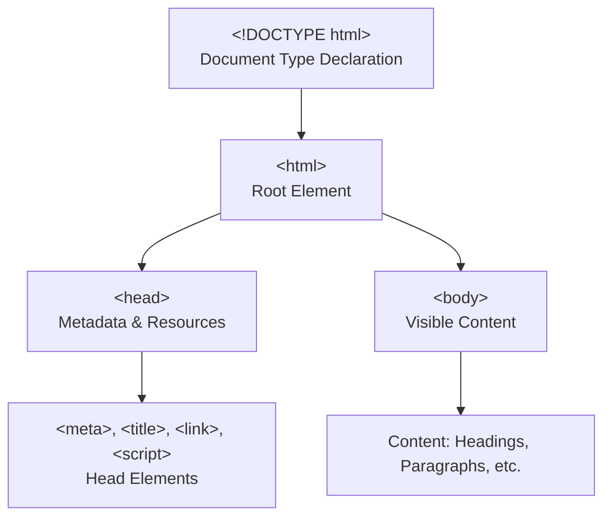

# Chapter 1: HTML Foundations

## 1. What is HTML? History and Role in the Web
HTML (HyperText Markup Language) is the standard language for creating web pages and web applications. It was first developed by Tim Berners-Lee in 1991 as a way to structure documents and link them together using hyperlinks. HTML provides the basic building blocks for the web, allowing browsers to interpret and display content. Over time, HTML has evolved (from HTML 1.0 to HTML5) to support multimedia, semantic elements, and interactive features, making it the backbone of the modern web.

**Key Points:**
- HTML is not a programming language; it is a markup language.
- It describes the structure and meaning of web content.
- Every website uses HTML as its foundation.

## 2. Anatomy of an HTML Document (doctype, html, head, body)

An HTML document is structured to provide both the content and the information about that content (metadata) to browsers and search engines. Here’s a breakdown of each part:

```html
<!DOCTYPE html>
<html lang="en">
  <head>
    <meta charset="UTF-8">
    <meta name="viewport" content="width=device-width, initial-scale=1.0">
    <meta name="description" content="A sample HTML document.">
    <title>Page Title</title>
    <!-- Links to CSS, scripts, icons, etc. -->
  </head>
  <body>
    <!-- Visible page content goes here -->
  </body>
</html>
```

- `<!DOCTYPE html>`: Declares the document type and version (HTML5). Ensures browsers render the page in standards mode.
- `<html lang="en">`: The root element that wraps all content. The `lang` attribute specifies the language for accessibility and SEO.
- `<head>`: Contains metadata and resources for the document. Not visible to users, but essential for browsers, search engines, and social media previews.
  - **Metadata**: Data about the document, such as character encoding, viewport settings, description, and keywords.
    - `<meta charset="UTF-8">`: Sets the character encoding to UTF-8, supporting most languages and symbols.
    - `<meta name="viewport" content="width=device-width, initial-scale=1.0">`: Ensures responsive design on mobile devices.
    - `<meta name="description" content="...">`: Provides a summary for search engines and social sharing.
    - `<meta name="keywords" content="...">`: (Optional) Lists keywords for search engines (less important today).
    - `<meta name="author" content="...">`: (Optional) Specifies the author of the document.
  - **Title**: `<title>` sets the page title shown in browser tabs and search results.
  - **Links to Resources**: `<link>` tags for CSS, icons, and other resources.
  - **Scripts**: `<script>` tags for JavaScript files (can also be placed at the end of `<body>` for performance).
- `<body>`: Contains all the visible content of the page—text, images, links, forms, etc. Only the content inside `<body>` is rendered in the browser window.

**Summary Table:**

| Element         | Purpose                                                      |
|-----------------|--------------------------------------------------------------|
| `<!DOCTYPE>`    | Declares HTML version, triggers standards mode               |
| `<html>`        | Root element, wraps all content                              |
| `<head>`        | Metadata, resources, not visible to users                    |
| `<body>`        | Visible content (text, images, links, etc.)                  |
| `<meta>`        | Metadata: encoding, viewport, description, author, etc.      |
| `<title>`       | Page title (browser tab, search results)                     |
| `<link>`        | External resources (CSS, icons)                              |
| `<script>`      | JavaScript files (behavior, interactivity)                   |

## 3. Basic Tags: Headings, Paragraphs, Line Breaks, Horizontal Rules
- **Headings (`<h1>`–`<h6>`)**: Define section titles, with `<h1>` as the most important and `<h6>` the least.
  - Example: `<h1>Main Title</h1>`
- **Paragraphs (`<p>`)**: Used for blocks of text.
  - Example: `<p>This is a paragraph.</p>`
- **Line Breaks (`<br>`)**: Inserts a single line break within text.
  - Example: `Line one<br>Line two`
- **Horizontal Rules (`<hr>`)**: Creates a thematic break or horizontal line.
  - Example: `<hr>`

## 4. Text Formatting: Bold, Italic, Underline, Subscript, Superscript, Code, Blockquote
- **Bold (`<b>`, `<strong>`)**: `<b>` for stylistic bold, `<strong>` for importance.
- **Italic (`<i>`, `<em>`)**: `<i>` for stylistic italics, `<em>` for emphasis.
- **Underline (`<u>`)**: Underlines text (use sparingly for accessibility).
- **Subscript (`<sub>`)**: Text below the baseline (e.g., H<sub>2</sub>O).
- **Superscript (`<sup>`)**: Text above the baseline (e.g., x<sup>2</sup>).
- **Code (`<code>`)**: Inline code snippets.
- **Blockquote (`<blockquote>`)**: For longer quotations, usually indented.

**Examples:**
```html
<strong>Bold</strong> <em>Italic</em> <u>Underline</u> H<sub>2</sub>O x<sup>2</sup> <code>let x = 5;</code>
<blockquote>This is a quoted section.</blockquote>
```

## 5. Comments and Whitespace
- **Comments**: Use `<!-- comment -->` to add notes in the code that are not displayed in the browser.
  - Example: `<!-- This is a comment -->`
- **Whitespace**: Spaces, tabs, and newlines in HTML are generally collapsed into a single space when rendered. Use whitespace to organize code for readability, but it will not affect the display unless using special tags (like `<pre>`).

## 6. Visual Diagram: HTML Document Structure



## 7. Common Mistakes to Avoid
- Omitting `<!DOCTYPE html>` can cause browsers to render in quirks mode.
- Forgetting to close tags (especially `<head>`, `<body>`, and block elements).
- Placing visible content inside `<head>` instead of `<body>`.
- Not specifying the `lang` attribute on `<html>` (affects accessibility and SEO).
- Using deprecated tags (like `<font>`, `<center>`, `<b>` for importance instead of `<strong>`).

## 8. Accessibility Notes
- Use semantic tags (e.g., headings, lists, `<main>`, `<nav>`) for better screen reader support.
- The `lang` attribute helps assistive technologies determine the language.
- Avoid using color alone to convey meaning.

## 9. Browser Rendering Notes
- Browsers collapse multiple spaces, tabs, and newlines into a single space (except in `<pre>` tags).
- Comments (`<!-- ... -->`) are ignored by browsers and not rendered.
- Browsers may auto-correct some errors, but this can lead to unpredictable results.

## 10. Real-World Example: Annotated HTML Page

```html
<!DOCTYPE html>
<html lang="en">
  <head>
    <meta charset="UTF-8">
    <meta name="viewport" content="width=device-width, initial-scale=1.0">
    <title>Sample Page</title>
  </head>
  <body>
    <h1>Welcome!</h1>
    <p>This is a sample HTML page.</p>
    <!-- This is a comment -->
  </body>
</html>
```

## 11. Further Reading
- [MDN Web Docs: HTML Basics](https://developer.mozilla.org/en-US/docs/Learn/Getting_started_with_the_web/HTML_basics)
- [WHATWG HTML Living Standard](https://html.spec.whatwg.org/)
- [WebAIM: Semantic Structure](https://webaim.org/techniques/semanticstructure/)

## 12. Tips for Writing Clean HTML
- Use consistent indentation (2 or 4 spaces).
- Comment sections of complex code for clarity.
- Use semantic tags for structure and accessibility.
- Validate your HTML using the [W3C Validator](https://validator.w3.org/).


